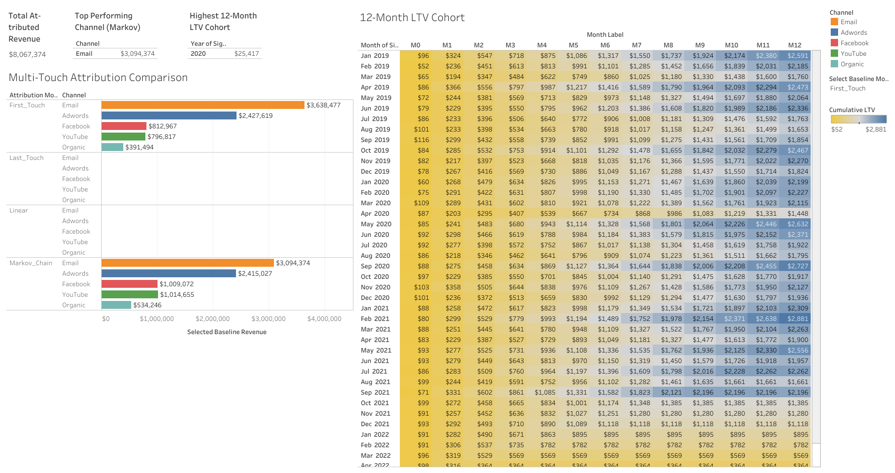
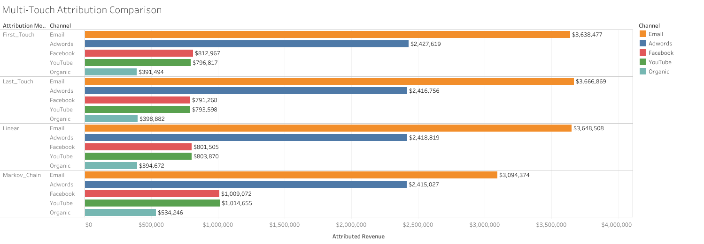
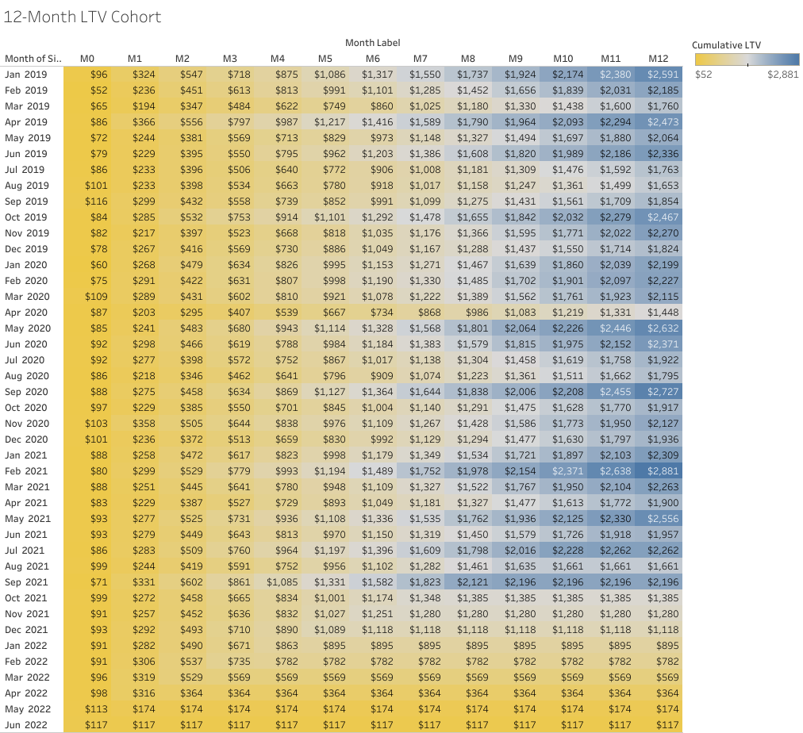
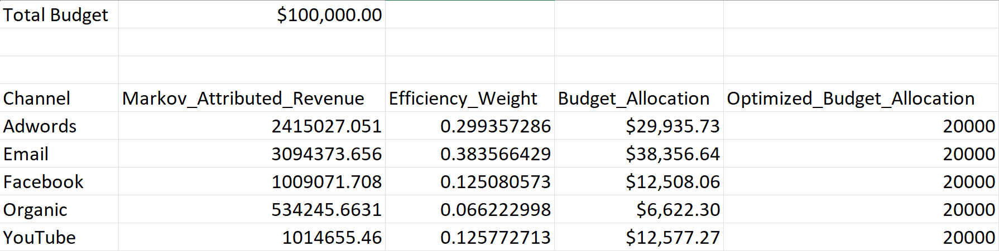

# Enterprise E-Commerce Multi-Touch Attribution and Customer Lifetime Value (LTV) Cohort Engine


## Executive Summary

Marketing teams often rely on single-touch attribution models such as **Last Touch**, which assign 100% of the conversion credit to the final customer interaction. While simple to implement, these models frequently overvalue bottom-of-funnel channels and undervalue earlier marketing touchpoints that influence customer decisions.

This project develops an end-to-end **Marketing Analytics Engine** using the **thelook_ecommerce** dataset to evaluate customer journeys through multiple attribution models, calculate Customer Lifetime Value (LTV), optimize marketing budget allocation, and visualize actionable insights through an interactive Tableau dashboard.

The project combines **DuckDB SQL**, **Python**, **Excel**, and **Tableau** to demonstrate a complete analytics workflow, from data engineering to executive reporting.

---

# Business Objectives

- Reconstruct customer conversion journeys from raw event-level data.
- Compare traditional attribution models with a Markov Chain Attribution Model.
- Quantify the contribution of each marketing channel using Removal Effect analysis.
- Analyze customer retention and spending using 12-month LTV cohort analysis.
- Optimize marketing budget allocation using Markov efficiency weights.
- Build an executive dashboard for marketing decision-makers.

---

# Key Insights

### Last-Touch Attribution Over-Credits Bottom-Funnel Channels

Traditional Last-Touch attribution allocated substantially more revenue to Direct and Paid Search than the Markov model, leading to distorted marketing ROI measurements.

### Markov Chain Identified Under-Valued Channels

Organic Search and Email demonstrated stronger transition efficiency and removal effects than suggested by Last-Touch attribution, indicating they deserve greater investment.

### Customer Spending Plateaus After Month 3

LTV cohort analysis revealed that cumulative customer spend begins to level off after **Month 3**, suggesting an opportunity for targeted retention and re-engagement campaigns.

### Budget Optimization

A hypothetical **$100,000** quarterly marketing budget was redistributed using channel efficiency weights derived from the Markov attribution model to maximize expected marketing impact.

---

# Technical Stack

| Category | Technologies |
|-----------|--------------|
| Database | DuckDB |
| SQL | Window Functions, CTEs, STRING_AGG |
| Programming | Python |
| Libraries | Pandas, NumPy, Matplotlib, SciPy |
| Financial Modeling | Microsoft Excel |
| Visualization | Tableau Public |
| Version Control | Git & GitHub |

---

# Original Dataset

This project uses the **thelook_ecommerce** dataset, a fictional e-commerce dataset created by Google for analytics and machine learning projects.

The dataset contains information on:

- Customer profiles
- Website events and user sessions
- Orders and order items
- Products and inventory
- Distribution centers

These tables were used to reconstruct customer journeys, build attribution models, perform cohort analysis, and optimize marketing budget allocation.

### Original Dataset

The complete dataset can be accessed from the following source:

- **Kaggle:** https://www.kaggle.com/datasets/mustafakeser4/looker-ecommerce-bigquery-dataset

> **Note:** This repository does **not** include the complete raw dataset due to its size. Instead, it includes the processed analytical datasets required to reproduce the attribution, LTV, and dashboard analyses.

---

# Project Architecture

```
Raw Data
      │
      ▼
DuckDB SQL Transformations
      │
      ▼
Conversion Paths
      │
      ▼
Attribution Engine
 ├── First Touch
 ├── Last Touch
 ├── Linear
 └── Markov Chain
      │
      ▼
LTV Cohort Analysis
      │
      ▼
Budget Optimization
      │
      ▼
Tableau Dashboard
```

---

# Repository Structure

```
ecommerce-multi-touch-attribution-ltv/
│
├── README.md
├── requirements.txt
├── 01_sql_transformations.py
├── 02_attribution_engine.py
├── 03_ltv_cohort_engine.py
├── 04_financial_optimization.py
├── 05_export_tableau_data.py
│
├── data/
│   ├── conversion_paths.csv
│   ├── attribution_model_comparison.csv
│   ├── tableau_attribution_unpivoted.csv
│   ├── tableau_ltv_matrix.csv
│   └── cohort_raw_data.csv
│
├── excel/
│   └── budget_optimization_model.xlsx
│
├── tableau/
│   └── Marketing_Analytics_Dashboard.twbx
│
└── assets/
    ├── dashboard_overview.png
    ├── attribution_dashboard.png
    ├── ltv_cohort_heatmap.png
    └── budget_optimization.png
```

---

# Technical Pipeline

## 1. SQL Data Engineering (DuckDB)

Customer conversion journeys were reconstructed by joining completed orders with website events and aggregating marketing touchpoints in chronological order.

Example:

```sql
STRING_AGG(traffic_source, ' > ') AS path
```

Outputs:

- conversion_paths.csv
- cohort_raw_data.csv

---

## 2. Multi-Touch Attribution Engine

Implemented four attribution models:

- First Touch
- Last Touch
- Linear Attribution
- Markov Chain Attribution

The Markov model evaluates the importance of each channel using **Removal Effect**, measuring the reduction in conversion probability when a channel is removed from the customer journey.

Outputs:

- attribution_model_comparison.csv
- tableau_attribution_unpivoted.csv

---

## 3. Customer Lifetime Value (LTV) Analysis

Constructed monthly customer cohorts based on signup month and calculated cumulative revenue over a 12-month period.

Outputs:

- cohort_raw_data.csv
- tableau_ltv_matrix.csv

---

## 4. Budget Optimization

Calculated channel efficiency weights from Markov attribution and distributed a hypothetical **$100,000** marketing budget proportionally across channels.

Features:

- Interactive Excel model
- Dynamic budget input
- Scenario analysis
- What-If planning

Output:

- budget_optimization_model.xlsx

---

## 5. Executive Dashboard

Built an interactive Tableau dashboard including:

- Multi-Touch Attribution Explorer
- Dynamic Markov vs Baseline comparison
- 12-Month LTV Cohort Heatmap
- Executive KPI Cards

---

# Dashboard Preview

## Executive Dashboard



---

## Multi-Touch Attribution Explorer



---

## Customer LTV Cohort Heatmap



---

## Budget Optimization Model



---

# How to Run the Project

Clone the repository:

```bash
git clone https://github.com/DevdattaMondal/ecommerce-multi-touch-attribution-ltv.git
```

Install dependencies:

```bash
pip install -r requirements.txt
```

Run the complete pipeline:

```bash
python 01_sql_transformations.py
python 02_attribution_engine.py
python 03_ltv_cohort_engine.py
python 04_financial_optimization.py
python 05_export_tableau_data.py
```

---

# Tableau Dashboard

**Interactive Dashboard**

Example:

```[
https://public.tableau.com/app/profile/devdatta.mondal/viz/EnterpriseE-CommerceMulti-TouchAttributionCustomerLTVAnalytics/ExecutiveMarketingDashboard
```

---

# Future Enhancements

- Higher-order Markov Chain attribution
- Time-decay attribution model
- Shapley Value attribution
- Marketing Mix Modeling (MMM)
- Interactive Streamlit web application
- Automated ETL pipeline with Apache Airflow

---

# Skills Demonstrated

- SQL (DuckDB)
- Data Engineering
- Customer Journey Analytics
- Multi-Touch Attribution Modeling
- Markov Chains
- Customer Lifetime Value (LTV)
- Cohort Analysis
- Marketing Analytics
- Budget Optimization
- Tableau Dashboard Development
- Microsoft Excel Financial Modeling
- Python Data Analysis
- Git & GitHub

---

# Author

**Devdatta Mondal**

Data Analyst | Marketing Analytics | SQL | Python | Tableau | Excel

- LinkedIn: *(https://www.linkedin.com/in/devdatta-mondal/)*
- Tableau Public: *(https://public.tableau.com/app/profile/devdatta.mondal/viz/EnterpriseE-CommerceMulti-TouchAttributionCustomerLTVAnalytics/ExecutiveMarketingDashboard)*
- GitHub: *(https://github.com/DevdattaMondal)*

---

# License

This project is intended for educational and portfolio purposes only.

The thelook_ecommerce dataset is subject to Kaggle's licensing terms and is **not redistributed** in this repository.
